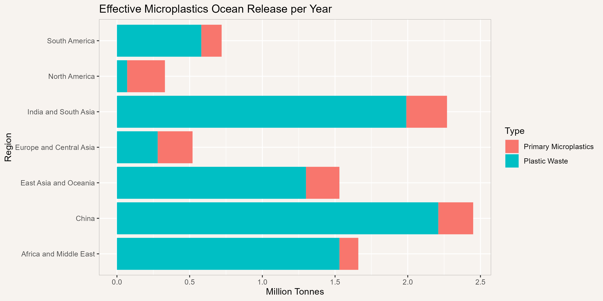
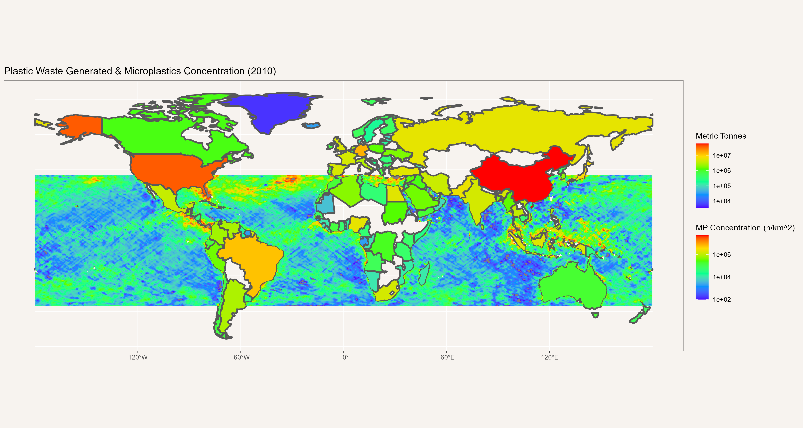
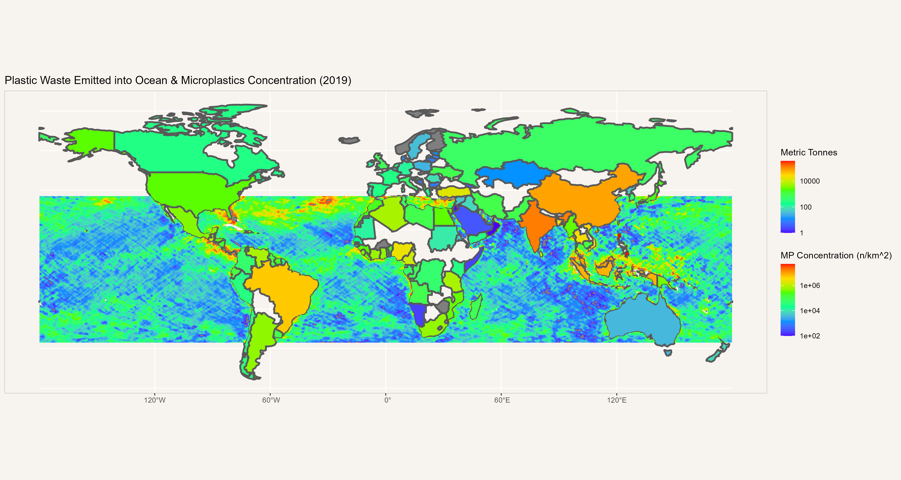
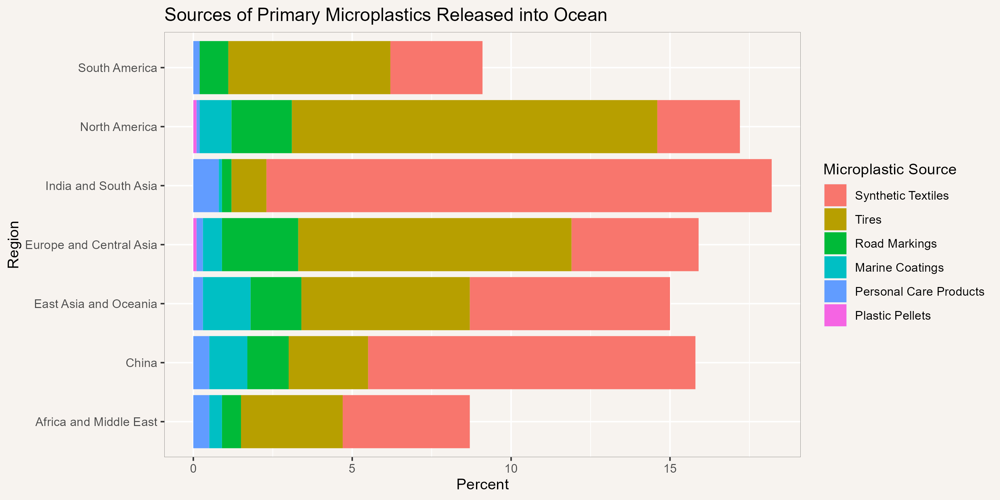
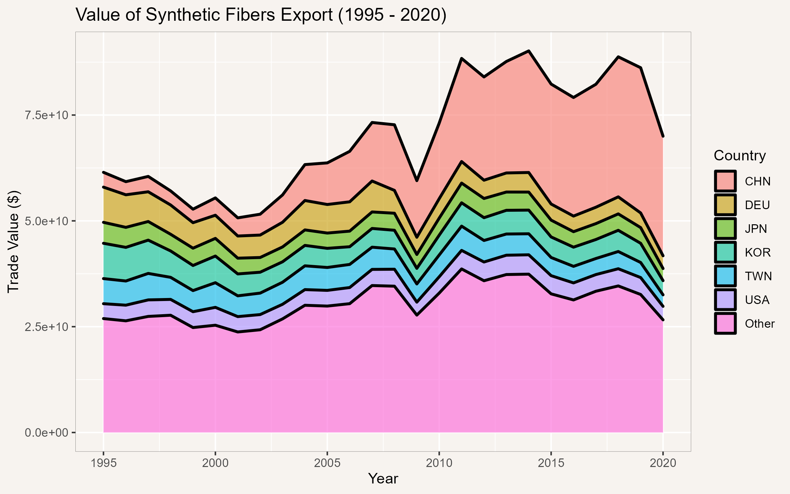
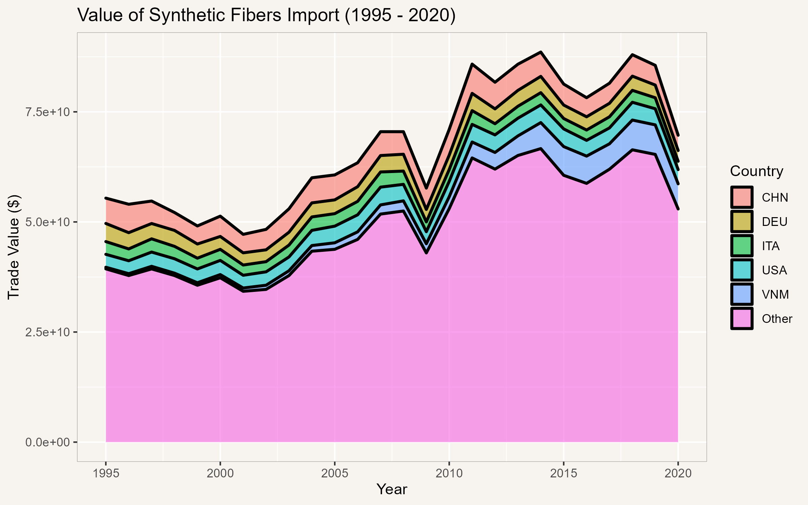
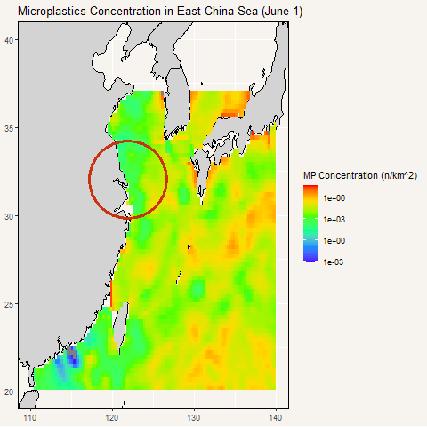
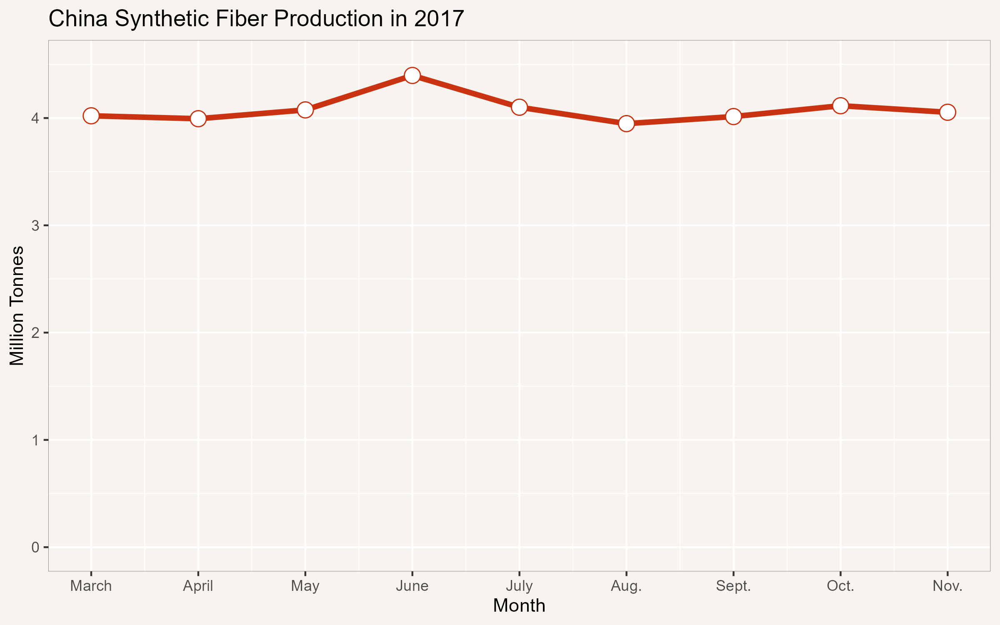

# Final assignment: Ocean Microplastics

Simply put, microplastics are tiny plastic fragments less than 5mm in size [1]. In general, there are two main types of microplastics - primary microplastics and secondary microplastics. Primary microplastics are the result of the direct production of microplastics. For example, microplastics in cosmetic products or from washing synthetic fibers can directly produce microplastics. Secondary microplastics, on the other hand, are small plastic fragments that result from the breakdown of larger plastic pieces. As an example, ocean waves and radiation from the sun can break down plastic bottles, thereby producing microplastics. 

While small in size, microplastics are pervasive in our environment with some research, in fact, suggesting that we might be consuming up to 5 grams of microplastics every week [2]. Microplastics, because of chemical additives, are not only harmful to humans, but they are also harmful to the environment, especially the marine ecosystem. Due to their size, microplastics are highly mobile and often end up in run-off, entering bodies of water such as lakes, rivers, and oceans, which subsequently get consumed by marine organisms. The overall pervasiveness of it in bodies of water as well as its potent effect on humans and the environment, therefore, makes studying microplastics in oceans an interesting and important topic. To this, we may ask the question - What are the factors that contribute to microplastic pollution in the ocean?

## Effective Microplastic Waste
Every year, countries around the world produce millions of tonnes of plastic waste, and oftentimes, the mismanagement of this waste results in it being emitted into the ocean. While not all emitted plastic waste is currently in the form of microplastics, the thing to note, however, is that these larger pieces of plastic will eventually decompose into smaller microplastics. What this means is that these larger pieces are plastic waste is effectively secondary microplastic waste given a later time. As such, to determine the "effective" amount of microplastics released into the ocean per year, we must also account for the macroplastics. The figure below shows this [3].

  

As depicted, except for North America and Europe & Central Asia, primary microplastic waste accounts for only a minor fraction of the total "effective" microplastic waste released yearly into the ocean. The majority of the effective waste comes from the secondary breakdown of microplastics. As a result, while both are important, it would not be incorrect to say most countries should focus efforts on reducing macroplastic waste as opposed to microplastics released into the ocean. 

While the amount of plastic waste and the amount of microplastics emitted into the ocean does not appear to be correlated, an overall map of ocean microplastic concentration [4] and plastic waste generated and emitted reveals some interesting trends. 

  

  

The ocean microplastic concentration shown in the above two heat maps is for June 1, 2018. They also show the amount, in metric tonnes, of plastic waste generated and emitted into the ocean respectively [5]. While there are temporal differences between the microplastic concentration and the plastic waste emission data, there do appear to be higher concentrations of microplastics in South Asia, where plastic waste emission is high. On the other hand, ocean microplastic concentration does not correlate as well with the amount of plastic waste generated, which is not always released into the ocean. This makes sense since plastic emission into the ocean is more directly related to primary and secondary microplastic emission and generation. 

There is another interesting trend simply looking at ocean microplastic concentration. That is, due to the size and mobility of microplastics, significant concentrations of microplastics can be found along global ocean currents. For example, there appear to be high concentrations of microplastics in the North Atlantic Gyre and along the North Equatorial and Equatorial Countercurrents. That said, once emitted, it is relatively easy for microplastics to ride the currents and be dispersed to other parts of the world. In fact, the effects of this can already be seen given almost all parts of the ocean shown contains some concentration of microplastics. 

## Source of Primary Microplastics
To further investigate and reduce the amount of primary microplastics released into the ocean, we must first understand its main sources and then target activities or industries that are responsible. The distribution of emitted primary microplastics for different regions is shown below [3].

  

As depicted above, there are six main sources of microplastic waste. Major sources such as synthetic textiles, tires, and personal care products seem to hint at the pervasiveness of microplastics in our lives. We see that in all regions, synthetic textiles and tires are the two major sources of microplastics released into the ocean. In the Americas and Europe, tires dominate microplastic pollution, whereas, in Asia, synthetic textiles dominate. Overall, synthetic textiles contribute the most to primary microplastics released into the oceans. 

## Synthetic Fibers and Microplastics in China
Synthetic textiles are a major source of microplastics in oceans today. To further investigate this issue, we will focus on the more general synthetic fibers industry. Synthetic fibers are a major industry in South and East Asia with the vast majority of the world's synthetic fibers coming from the area. Its significance in terms of export and import values of synthetic fibers between 1995 and 2020 is shown below [6]. 

  

  

As seen, China, Germany, and the United States are all major contributors to synthetic fibers export and import between 1995 and 2020. While synthetic fiber imports are relatively uniform. across countries, synthetic fibers exports are not. In fact, almost 40% of the world's synthetic fibers came from China in 2020 [7]. This makes the synthetic fibers industry in China a potentially excellent source of ocean-bound microplastics. To verify this idea, we will again use the ocean microplastic concentration derived via remote sensing imagery [4]. 

  

Particularly, and as noted by the researchers in [4], there was a bloom in microplastic concentration in China at the Yangtze River Delta in the last weeks of June 2017. As can be seen within the red circle, microplastic concentration appears to increase beginning June 19 and continues through to the end of the month, reaching levels over 10 million parts per square km. The origins of microplastics from the Yangtze River Delta, however, are not surprising. This is because most of China's synthetic fibers and textile industry is along the coastline, in the Zhejiang province and the Shanghai area, within and south of the red circle. To further correlate this observation with synthetic fiber production in China, it can be seen that bloom in microplastics corresponds with a heightened synthetic fiber in June of that year (2017) [8]. 

  

As for why a slight increase in synthetic fiber production may lead to a drastic bloom in microplastics release, this is still an open question. 

## Conclusion
Microplastics in oceans come mostly from ordinary sources such as textiles, tires, and cosmetic products. They have been shown to spread pervasively throughout the world's oceans with high concentrations along major ocean currents. While often accounting for only a small fraction of total plastics released into the world's oceans, its chemical potency, and its secondary formation will likely cause great harm to humans, other organisms, and the environment. While microplastics are small and often intangible, it is important to remember that this intangibility is what makes microplastics even more pervasive, dangerous, and obscure. 

## References
[1] Collignon, A., Hecq, J.-H., Galgani, F., Collard, F., &amp; Goffart, A. (2014). Annual variation in neustonic micro- and Meso-plastic particles and zooplankton in the Bay of Calvi (mediterranean–corsica). Marine Pollution Bulletin, 79(1-2), 293–298. https://doi.org/10.1016/j.marpolbul.2013.11.023 

[2] WebMD. (2022, October 28). Microplastics and health risks: What do we really know? WebMD. Retrieved December 9, 2022, from https://www.webmd.com/a-to-z-guides/news/20221028/microplastics-health-risks-what-do-we-really-know#:~:text=Microplastics%20as%20Carriers&amp;text=%E2%80%9CThese%20chemicals%20are%20known%20environmental,inflammation%2C%20or%20other%20unknown%20effects. 

[3] Boucher, J., &amp; Friot, D. (2017). Primary microplastics in the oceans: A global evaluation of sources. https://doi.org/10.2305/iucn.ch.2017.01.en 

[4] Evans, M. C., &amp; Ruf, C. S. (2022). Toward the detection and imaging of ocean microplastics with a spaceborne radar. IEEE Transactions on Geoscience and Remote Sensing, 60, 1–9. https://doi.org/10.1109/tgrs.2021.3081691 

[5] Ritchie, H., &amp; Roser, M. (2018, September 1). Plastic pollution. Our World in Data. Retrieved December 9, 2022, from https://ourworldindata.org/plastic-pollution#citation 

[6] The Growth Lab at Harvard University. (2022, August 3). International Trade Data (HS, 92). Harvard Dataverse. Retrieved December 9, 2022, from https://dataverse.harvard.edu/dataset.xhtml?persistentId=doi%3A10.7910%2FDVN%2FT4CHWJ&amp;version=5.0 

[7] Synthetic fabrics. OEC. (n.d.). Retrieved December 9, 2022, from https://oec.world/en/profile/hs/synthetic-fabrics#:~:text=In%202020%2C%20the%20top%20exporters,%2C%20and%20China%20(%24114M) 

[8] 2017年2-11月我国合成纤维产量4132.5万吨，其中6月产量最高. (2018, January 19). Retrieved December 9, 2022, from https://www.chinabaogao.com/detail/315036.html 

[Back](../README.md)