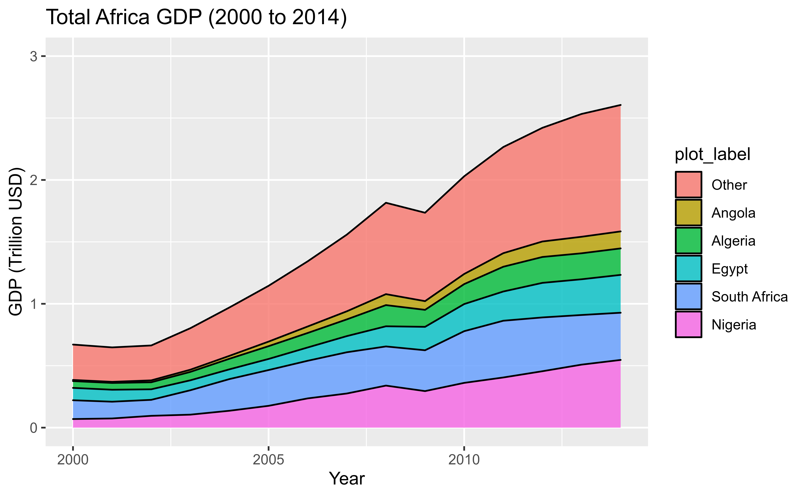

# Short Form Blog 1: Energy in Africa - Who Should Be Responsible?

Energy consumption and electrification access in sub-Saharan Africa today look abysmal. While the region accounts for only 13% of the world's population, it accounts for 48% of the world's population without electricity [1]. The implication of these figures is that less than 20% of the population in that region has access to electricity. Despite these trends, however, it is projected that in less than 20 years, by 2040, electricity consumption in this region will increase four-fold with 70-80% electrification in union with a five-fold increase in GDP [1]. 

Given this stark uptick in projected energy consumption, there are several important questions to answer before meaningful progress can be made. First, where is the energy coming from? In general, there are two types of sources - sustainable and unsustainable sources. While the use of sustainable energy currently seems like a "nice alternative," the use of sustainable energy in Africa is absolutely essential for its energy supply stability in the long term given the eventual depletion of fossil fuels within this century. The second question is, who is responsible for driving progress in Africa toward more sustainable sources of energy? While it is easy to say that everyone should have some level of responsibility, the repercussion of this result in no one being responsible. As such, it should be fair to say that the sectors that consume the greatest proportion of electricity should be the leading drivers toward more sustainable energy production. Here, we consider three different sectors - household, industry, and government - as potential drivers for the sustainable energy problem in Africa.

## Datasets
To evaluate the questions on Africa's energy source and its sustainability, energy consumption, and production levels are needed. It might also be helpful to include information on economic development within the continent to further correlate with energy consumption. The primary dataset for energy data in Africa is from The Humanitarian Data Exchange on African Regional Energy Statistics, 2014. Particularly of interest, there is data on electricity production and consumption in different African countries between 2000 and 2014 for different sources and sectors respectively. Otherwise, the dataset also contains data on the number of fossil fuels used. Given that the data is fairly complete and the source is considered an OCHA service, the dataset is legitimate. 

The secondary dataset on country GDP is from World Bank. The dataset includes the GDP for every country around the world in units of current USD from 1960 to 2021. This dataset is limited by some missing GDP values for a handful of African countries between the desired date range (2000-2014) but is otherwise trustworthy as World Bank is a credible data source. 

## Economic Driver
It's been long known that GDP and energy utilization are coupled and that growth in GDP also requires a growth in energy demand [2]. To put this into the context of African countries, the continent has seen almost a 4-fold increase in GDP from 2000 to 2014 as shown below.

  

The top five contributors in 2014 are Angola, Algeria, Egypt, South Africa, and Nigeria, which alone account for more than half the continent's GDP and growth in the last 15 years. An interesting feature of the above plot is the kink between 2008 and 2009 likely attributed to the 2008 financial crisis. It is also important to note that this plot does not show per-capita GDP and thus does not account for increases in population in Africa, which is estimated to be around 35-40%. However, it is safe to say that there has also been an increase in per-capita GDP.

Now, given Africa's increase in GDP, it is also expected that its energy demand to increase. To further highlight the correlation between GDP and energy demand/production, the visualization below depicts electricity production and GDP of countries in Africa from 2000 to 2014.

  

Notice that both GDP and total electricity production are depicted using a log-scale. This indicates two important features of the data. First, the linear correlation seen in the plot between GDP and total electricity production is indeed linear, and countries do not deviate from this linear trend between 2000 and 2014. Countries are seen to generally move diagonally upwards as opposed to strictly vertically or horizontally, suggesting growth in GDP is coupled with a growth in total electricity production. The second key feature to highlight is the use of a log scale itself. This indicates there is a severe discrepancy (in the orders of magnitude) in the productivity and economic development of different countries in Africa. While more recent data is desirable, this 15-year trend depicts the energy correlation in a developing economy. This brings us to our first question.

## Where is the Energy Coming From?
Given growth in Africa's economy will unquestionably increase its energy demand, the next intuitive question to ask is how will countries in Africa produce energy, more specifically, electricity. As an example of recent trends, consider the following visualization depicting the percent of sustainable electricity produced by African countries related to total electricity produced and economic development (GDP). 

  

The key trend to note here is that countries that produce more than 10 thousand GWh of electricity all rely heavily on unsustainable sources of energy with less than 25% of electricity sustainably produced. On the other hand, there is more diversity in countries that produce less than 10K GWh. This potentially suggests an upper bound in current technology for scalability energy production. A good example that illustrates this is Nigeria. As shown in the visualization, in the early 2000s, 50% of electricity production in Nigeria used sustainable resources. However, as its GDP increased along with electricity production past 10K GWh, the sustainable percentage dropped sharply to only 17% in 2014. 

While this visualization does not give a reason for this apparent energy wall nor does it indicate any sort of causal relationship between total electricity produced and sustainability, it is a warning that African countries might compromise sustainability in favor of short-term economic growth and total energy production in the future. This brings us to the second question.

## Who is Responsible for Driving Sustainability in Energy Production?
Given the current problems with sustainable energy production in Africa, which sector - industry, household, or government - should drive more sustainable energy production? While the answer to this question might be nuanced, the simplest approach is to assign responsibility to the sector that consumes the most electricity. The below visualization shows the amount and proportion of total electricity consumed by each sector. 

  

From this visualization, Africa's electricity consumption has been increasing in all three sectors. It is also evident that the industrial sector consumes the highest proportion of electricity at around 50 percent. Interestingly, however, the proportion of electricity consumption in the industrial sector has been decreasing from 2000 to 2014 and its consumption in the household and public sectors has risen. While the use of more sustainable sources of energy should be driven by the industry sector, the actual execution of the pivot to more sustainable resources should involve all sectors. These sectors, after all, are not mutually exclusive. The main limitation of this figure is that it only shows energy consumption in terms of electricity. It would have been more beneficial if there was data on the total amount of energy consumed (mutually exclusive in terms of different forms of energy) relative to each sector. 

## Conclusion
Overall, regarding Africa's projected increase in energy demand, there are two important questions to address. First, where is the energy coming from, and second, who is responsible for driving progress in Africa towards more sustainable sources of energy? From the initial analysis, the answer to the first question is mixed. While sustainable energy can support countries below a certain electricity production threshold, countries that output more electricity will still default mostly to unsustainable sources. The answer to the second question is that the industrial sector should be the proponent drivers of sustainable energy; however, its execution and adoption require involvement from all sectors - industry, household, and public/government. While the task of pivoting towards sustainability may seem daunting, it is an essential aspect of long-term stable growth in Africa.

## References
1. Castellano, A., Kendall, A., Nikomarov, M., &amp; Swemmer, T. (2018, January 8). Powering Africa. McKinsey &amp; Company. Retrieved October 23, 2022, from https://www.mckinsey.com/industries/electric-power-and-natural-gas/our-insights/powering-africa 
2. Sharma, N., Smeets, B., &amp; Tryggestad, C. (2020, September 16). The decoupling of GDP and energy growth: A CEO guide. McKinsey &amp; Company. Retrieved October 23, 2022, from https://www.mckinsey.com/industries/electric-power-and-natural-gas/our-insights/the-decoupling-of-gdp-and-energy-growth-a-ceo-guide 

## Data Sources
1. African Regional Energy Statistics 2014
    - https://data.humdata.org/dataset/african-regional-energy-statistics-2014
2. The World Bank GDP
    - https://data.worldbank.org/indicator/NY.GDP.MKTP.CD

[Back](../README.md)