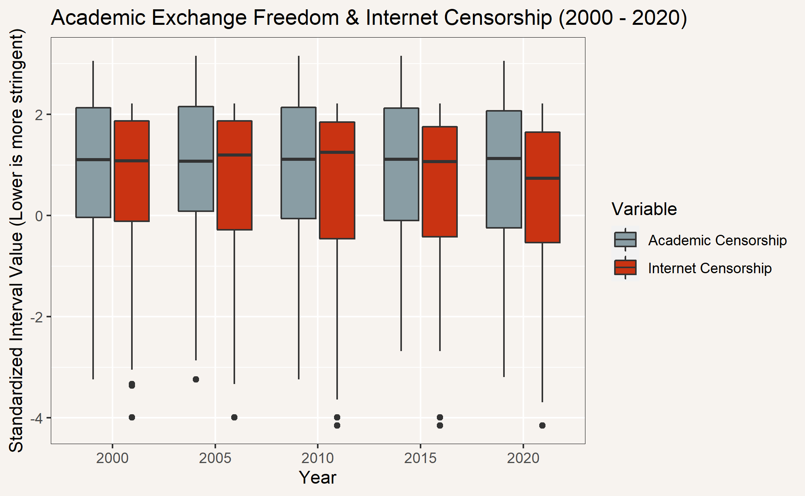

# Short Form Blog 2: Many ways to see it

The two [V-Dem](https://www.v-dem.net/static/website/img/refs/codebookv111.pdf) variables were Internet Censorship Effort (v2mecenefi), abbreviated as ICE, and Freedom of Academic Exchange and Dissemination (v2cafexch), abbreviated as FAED. ICE is the government's attempt to censor internet content or access, it is measured on an ordinal scale of 0 to 3 where 0 denotes complete stringent government censorship and 3 denotes unrestricted internet access. FAED measures restrictions on academic information for those in academia and the public. It is measured on an ordinal scale of 0 to 4 where 0 indicates consistent stringent academic censorship and 4 indicates no academic censorship. Overall, I thought the granularity of the FAED measurement could be improved. I would actually break the FAED variable into two variables. One measuring freedom of academic exchange and one measuring the freedom of academic dissemination. The two seem separate as the former is concerned with academic advancements and the latter is concerned with public advancement.

Most of the time, internet censorship within countries relates to politics and political ideas, however, it is clear that censorship of these political ideas will inevitably also correlate with the censorship of academic ideologies. From the recent map below, by comparing the relative colors of different countries, internet censorship is clearly linked to academic censorship. Note that the figure uses the ordinal scale and higher values mean more relaxed regulations. 

  

Apart from the censorship relationship, it appears that the Americas, Europe, and Australia generally have less censorship compared to the other continents. To further investigate this relationship, I have plotted these ordinal censorship values w.r.t. different regions below.

  

We see that these regions generally follow a linear correlation between ICE and FAED with respectable variance. As expected, there is clustering in the Americas, Europe, and Oceania where censorship of both variables is low. Africa and Asia, on the other hand, are more uniform. 

The implications of these linear trends highlight the potential reliance academia has on the internet. While it might be possible governments are proactively censoring academic exchange and dissemination on other channels, it is also possible that academic censorship is really an adverse effect of the broader internet censorship. 

The trends in Africa and Asia seem to also support this hypothesis. Given many countries in Africa and Asia are still developing, it's counter-intuitive that they should censor academic exchange and dissemination, hinting at academic censorship being an artifact. 

  

The density plot for academic and internet censorship (interval scale) tells a similar story with overlapping distributions. Both distributions are left-skew meaning most countries have few regulations but a small set of countries have very stringent regulations. The change in internet censorship over time is interesting and is further investigated in the box plot below.

  

Overall, while academic censorship among countries appears to remain consistent over the past 20 years, the internet, overall, has become slightly more restricted, but not by a significant amount. This suggests that the overall situation on academic censorship is not improving and internet censorship might, in fact, be degenerating. 

[References](static/references.pdf)

[Back](../README.md)