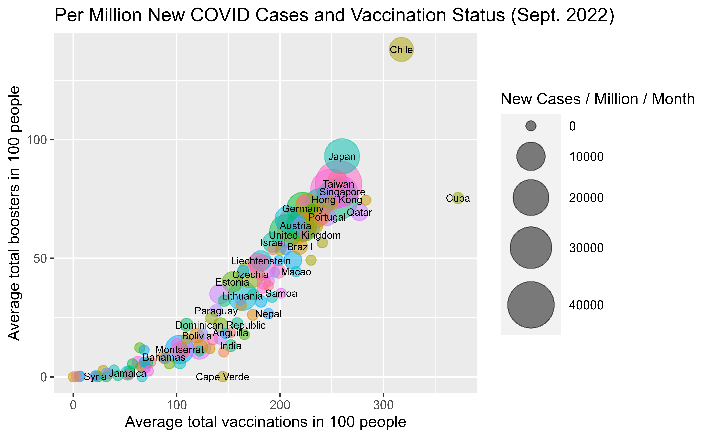

# Visualization Blog 1: Controversy

## Consumer Price Index Changes and Relative Importance - Good Visualization

<p align="center">
  
</p>

I like this visualization since it conveys information about inflation in a very efficient manner. In particular, by using the bubble size to indicate the relative importance of the item group in the CPI, I am quickly able to see the breakdown of inflation and its impact on my spending. Overall, the use of different-sized bubbles is a very intuitive way to convey impact and importance. 

```
Category <- c("Food at home", "Food away from home", "Energy commodities", "Energy services", "Commodities less food and energy commodities", "Services less energy services")
year_precent_chg <- c(13.5, 8.0, 27.1, 19.8, 7.1, 6.1) / 100
month_percent_chg <- c(0.7, 0.9, -11.7, 1.8, 0.5, 0.5) / 100
relative_importance <- c(8.414, 5.113, 5.170, 3.612, 21.168, 56.523)

cpi_data <- data.frame(Category, year_precent_chg, month_percent_chg, relative_importance)

cpi_data %>%
  ggplot(aes(x=year_precent_chg, y=month_percent_chg, size=relative_importance, color=Category)) + 
  xlim(0.05, 0.275) + xlab("Over-the-year percent change") +
  scale_x_continuous(labels = percent) +
  ylim(-14.0, 4) + ylab("Over-the-month percent change") +
  scale_y_continuous(labels = percent) +
  scale_size(name="Relative Importance") +
  geom_vline(xintercept = 0.083, linetype="dashed", size=0.2, color = "darkgreen", size=1) +
  geom_hline(yintercept = 0, linetype="dashed", size=0.2, color = "darkgreen", size=1) +
  annotate(geom="text", x=0.115, y=-0.12, label="All items: 8.3%", size=3) +
  annotate(geom="text", x=0.08, y=-0.004, label="All items: 0.0%", size=3) +
  geom_point(alpha=0.5)

```
Result:
<p align="center">
  
</p>

## Student Debt Relief - Bad Visualization
<p align="center">
  
</p>

I thought the above figure that depicts the cost of college versus the amount of federal support over the last 40 years is somewhat misleading. First, it is unclear how the university costs shown in red were determined as tuition for different public four-year universities vary. It may be the case a specific tuition percentile is chosen to exaggerate the results. 

While the yellow line depicting the maximum Pell Granth values does not suffer from the same ambiguity as the university cost line, the use of the maximum Pell Grant value gives little information about the actual distribution of grant values given to students when, for example, the calculation of Expected Family Contribution (EFC) changes. This has the potential to undermine federal support when, for instance, more people are going to college or when more students are receiving the maximum Pell Grant values. 

To address the first concern, I would be explicit and calculate the university cost by taking the median tuition of all those who received the Pell Grant. To address the second concern, I would use average Pell Grant values with error bars instead of showing just the maximum Pell Grant values.

## COVID Vaccine and Booster Results
<p align="center">
  
</p>

With this visualization, I attempt to show some correlation between the severity of COVID-19 infections and the vaccination status of different countries in September 2022. There, interestingly, seem to be a positive correlation between new cases per month and vaccination and booster status.

To create this visualization, I obtained data from [Our World in Data](https://ourworldindata.org/covid-vaccinations). I filtered out data only from September 2022 and focused on the following columns: location, new cases per million, total vaccinations per hundred, and total boosters per hundred. I also left out rows that were missing data in these columns. Following this, I grouped by location and reduced the new case data with summation and vaccination data with average. I then used a bubble plot in ggplot to draw the visualization.

## References
U.S. Bureau of Labor Statistics. (n.d.). Charts related to the latest "consumer price index" news release. U.S. Bureau of Labor Statistics. Retrieved October 9, 2022, from https://www.bls.gov/charts/consumer-price-index/consumer-price-index-relative-importance.htm 

The United States Government. (2022, August 24). Fact sheet: President Biden announces student loan relief for borrowers who need it most. The White House. Retrieved October 9, 2022, from https://www.whitehouse.gov/briefing-room/statements-releases/2022/08/24/fact-sheet-president-biden-announces-student-loan-relief-for-borrowers-who-need-it-most/ 

Ritchie, H., Mathieu, E., Rodés-Guirao, L., Appel, C., Giattino, C., Ortiz-Ospina, E., Hasell, J., Macdonald, B., Beltekian, D., &amp; Roser, M. (2020, March 5). Coronavirus (COVID-19) vaccinations. Our World in Data. Retrieved October 10, 2022, from https://ourworldindata.org/covid-vaccinations 

[Back](../README.md)