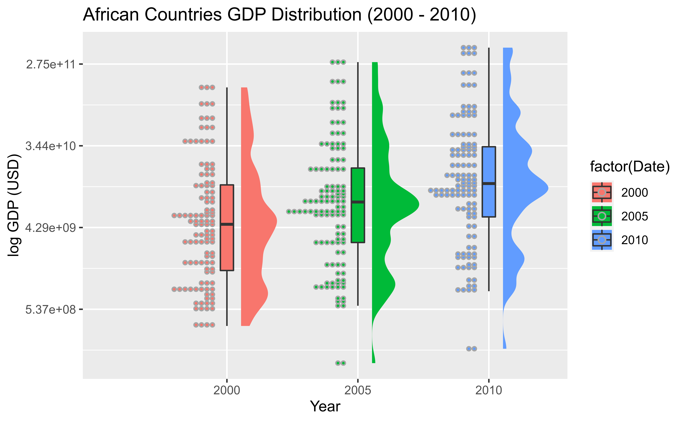
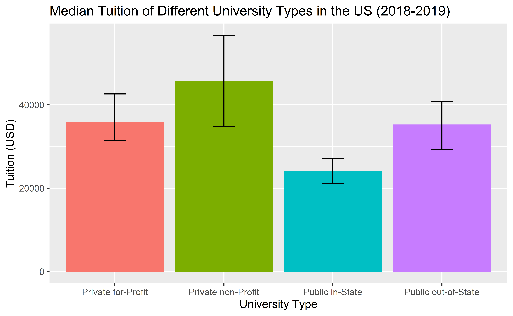

# Visualization Blog 2: Adding Uncertainty

  

Uncertainty is displayed and calculated automatically using the geom_boxplot function, showing the different quartiles of the country's GDP in Africa from 2000 to 2010. Uncertainty is depicted using median and IQR since there are outliers in the dataset. I chose a log scale for GDP to make the plot easier to visualize. The added benefit is that people can easily see that the distribution of country GDPs in Africa roughly follows a log-normal distribution, indicating right-skew. The added dot plot and density plot is used to further depict nuances in the distribution for each year. 

  

I calculated uncertainty by taking the median, Q1, and Q3 of different university types across the US since the dataset contains outliers. I chose to represent the median using the height of the bar chart and the IQR using the error bars since this allows the user to easily see the spread of the data and roughly pick out the percentage overlap between tuition rates of different university types. 

## Data Sources
1. African Regional Energy Statistics 2014
    - https://data.humdata.org/dataset/african-regional-energy-statistics-2014
2. The World Bank GDP
    - https://data.worldbank.org/indicator/NY.GDP.MKTP.CD
3. LendEDU (Cost of College in the U.S. – Average Statistics & Institution-Specific Costs)
    - https://lendedu.com/blog/average-cost-of-college-statistics/#privatefp

[Back](../README.md)